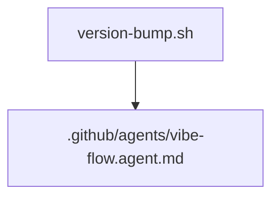

# Technical Specification: version-bump script fix

**Date**: 2026-01-17  
**Agent**: research.agent  
**Status**: Draft  
**Related Plan**: .github/plans/in-progress/versioning/script-fix/  
**Based on Research**: 3-RESEARCH.md

---

## 1. Executive Summary

### What are we building?

A minimal update to the version bump script so it targets the actual agent file location and fails with a clear error when missing.

### Why?

The script currently references a non-existent path, which prevents automated version bumping and contradicts the documented repository layout.

### Success Metrics

- The script reads and updates the version tag in .github/agents/vibe-flow.agent.md.
- The script exits with a clear error if the agent file cannot be found.

---

## 2. Architecture Design

### System Overview

### Key Architectural Decisions

**Decision 1**: Anchor the agent file path to the repository root (script directory).

- **Rationale**: Prevents failures when running the script from other working directories.
- **Alternatives Considered**: Auto-discovering the file via search.
- **Trade-offs**: Slightly more script logic, but minimal risk.

**Decision 2**: Use .github/agents as the canonical location.

- **Rationale**: Matches documented installation layout.
- **Alternatives Considered**: Retaining agents/ or duplicating files.
- **Trade-offs**: None, this aligns with existing docs.

---

## 3. Implementation Details

### Behavior Changes

1. Resolve the repository root from the script location.
2. Set AGENT_FILE to .github/agents/vibe-flow.agent.md under the repo root.
3. If the file does not exist, exit with a clear error describing the expected path.
4. Proceed with existing version parse and update logic.

### Files to Modify

| File                               | Changes Needed                                      | Risk   |
| ---------------------------------- | --------------------------------------------------- | ------ |
| [version-bump.sh](version-bump.sh) | Update path resolution and add file existence guard | 🟢 Low |

---

## 4. Testing Strategy

### Manual Verification

- Run ./version-bump.sh patch from the repository root.
- Run ./version-bump.sh patch from a different working directory to confirm path anchoring.
- Verify the version comment in [.github/agents/vibe-flow.agent.md](.github/agents/vibe-flow.agent.md) updates correctly.

---

## 5. Risks and Mitigation

| Risk                                                       | Impact | Likelihood | Mitigation Strategy                          | Owner | Status     |
| ---------------------------------------------------------- | ------ | ---------- | -------------------------------------------- | ----- | ---------- |
| Script path assumptions break in non-standard repo layouts | Medium | Low        | Anchor to script directory and validate path | Dev   | Monitoring |

---

## 6. Open Questions

- [ ] Should the script support a fallback to agents/vibe-flow.agent.md for legacy repos?

---

## 7. References

- [3-RESEARCH.md](.github/plans/in-progress/versioning/script-fix/3-RESEARCH.md)
- [version-bump.sh](version-bump.sh)
- [.github/agents/vibe-flow.agent.md](.github/agents/vibe-flow.agent.md)
- [install-vibeflow.md](install-vibeflow.md)

---

## Metadata

**Version**: 1.0  
**Last Updated**: 2026-01-17
