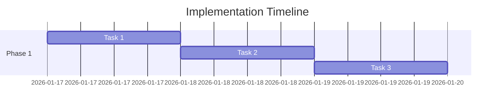

# Task Plan: Rename legacy 5-PLAN.md files

**Date**: 2026-01-17  
**Agent**: plan-writer.agent  
**Status**: Complete  
**Related Plan**: .github/plans/in-progress/maintenance/rename-5-plans/  
**Based on Spec**: 4-SPEC.md

---

## Overview

### Goal

Rename all legacy 5-PLAN.md files under .github/plans/\*\* to 5-TASKS.md with no content changes.

### Approach

One-time file rename-only migration scoped to .github/plans/\*\* using explicit paths from research, then verify no remaining 5-PLAN.md and git status shows only renames.

### Estimated Effort

**Total**: 1–2 hours  
**Complexity**: 🟢 Low

---

## Pre-Implementation Checklist

- [x] Spec reviewed and approved (4-SPEC.md)
- [x] Research findings validated (3-RESEARCH.md)
- [x] Dependencies identified and available
- [x] Test strategy defined (verification-only)
- [x] Rollback plan in place (if high-risk)

---

## Implementation Tasks

### ✅ Task 1: Confirm rename inventory

**Goal**: Validate the exact list of 5-PLAN.md files to rename.

**Files**:

- .github/plans/in-progress/agents/plan-writer-subagent/5-PLAN.md (rename)
- .github/plans/complete/versioning/script-fix/5-PLAN.md (rename)
- .github/plans/complete/agents/parallel-subagents/5-PLAN.md (rename)
- .github/plans/complete/skills/add-mermaidjs-v11-skill/5-PLAN.md (rename)
- .github/plans/complete/agents/parallel-subagents-visualization/5-PLAN.md (rename)
- .github/plans/complete/doc-updates/update-readme-mermaid-v2/5-PLAN.md (rename)
- .github/plans/complete/agents/holistic-alignment-review/5-PLAN.md (rename)
- .github/plans/complete/skills/add-research-skill/5-PLAN.md (rename)

**Steps**:

1. Re-scan .github/plans/\*\* for 5-PLAN.md.
2. Confirm the list matches research evidence.
3. Record any discrepancies in 2-PROGRESS.md before renaming.

**Verification**:

- [x] List matches 3-RESEARCH.md inventory
- [x] No non-plan files included

**Dependencies**: None

**Estimated Time**: 15 minutes

**Status**: ✅ Complete

**Notes**: Rename-only; do not edit contents.

---

### ✅ Task 2: Rename legacy files to 5-TASKS.md

**Goal**: Perform file renames without modifying contents.

**Files**:

- .github/plans/in-progress/agents/plan-writer-subagent/5-PLAN.md → .github/plans/in-progress/agents/plan-writer-subagent/5-TASKS.md
- .github/plans/complete/versioning/script-fix/5-PLAN.md → .github/plans/complete/versioning/script-fix/5-TASKS.md
- .github/plans/complete/agents/parallel-subagents/5-PLAN.md → .github/plans/complete/agents/parallel-subagents/5-TASKS.md
- .github/plans/complete/skills/add-mermaidjs-v11-skill/5-PLAN.md → .github/plans/complete/skills/add-mermaidjs-v11-skill/5-TASKS.md
- .github/plans/complete/agents/parallel-subagents-visualization/5-PLAN.md → .github/plans/complete/agents/parallel-subagents-visualization/5-TASKS.md
- .github/plans/complete/doc-updates/update-readme-mermaid-v2/5-PLAN.md → .github/plans/complete/doc-updates/update-readme-mermaid-v2/5-TASKS.md
- .github/plans/complete/agents/holistic-alignment-review/5-PLAN.md → .github/plans/complete/agents/holistic-alignment-review/5-TASKS.md
- .github/plans/complete/skills/add-research-skill/5-PLAN.md → .github/plans/complete/skills/add-research-skill/5-TASKS.md

**Steps**:

1. Rename each 5-PLAN.md to 5-TASKS.md in place.
2. Avoid opening or editing file contents.
3. Ensure each folder has only the new filename.

**Verification**:

- [x] No 5-PLAN.md remains under .github/plans/\*\*
- [x] Each destination 5-TASKS.md exists

**Dependencies**: Requires Task 1 complete

**Estimated Time**: 20 minutes

**Status**: ✅ Complete

**Notes**: Pure rename only; no content edits.

---

### ✅ Task 3: Validate git status and archive evidence

**Goal**: Ensure the change set is rename-only within .github/plans/\*\*.

**Files**:

- .github/plans/\*\* (rename-only)

**Steps**:

1. Check git status for rename-only changes.
2. Confirm paths are limited to .github/plans/\*\*.
3. Update 2-PROGRESS.md with verification results.

**Verification**:

- [x] Git status shows only renames in .github/plans/\*\*
- [x] No other files modified

**Dependencies**: Requires Task 2 complete

**Estimated Time**: 15 minutes

**Status**: ✅ Complete

**Notes**: Record any anomalies in 2-PROGRESS.md.

---

## Risk Mitigation

### High-Risk Tasks

| Task   | Risk                            | Impact | Mitigation                     | Status      |
| ------ | ------------------------------- | ------ | ------------------------------ | ----------- |
| Task 2 | Accidental content modification | Medium | Rename-only; do not open files | 🔄 Planning |

### Destructive Actions

No destructive actions planned (rename-only).

---

## Progress Tracking

### Summary

| Status         | Count | Tasks     |
| -------------- | ----- | --------- |
| ✅ Complete    | 3     | Tasks 1-3 |
| 🔄 In Progress | 0     | -         |
| ⬜ Not Started | 0     | -         |
| **Total**      | **3** | -         |

### Timeline

### Completion Criteria

- [x] All tasks marked as ✅ Complete
- [x] All verification steps passed
- [x] No remaining 5-PLAN.md under .github/plans/\*\*
- [x] Git status shows rename-only changes within .github/plans/\*\*

---

## Notes for Implement Agent

### Code Conventions

- No content edits; rename only.
- Limit changes to .github/plans/\*\*.

### Testing Patterns

- Verification is file-system and git-status based.

### Key Files to Reference

- .github/plans/in-progress/maintenance/rename-5-plans/3-RESEARCH.md - inventory evidence
- .github/plans/in-progress/maintenance/rename-5-plans/4-SPEC.md - acceptance criteria

### Common Pitfalls

- ⚠️ Editing file contents during rename.
- ⚠️ Renaming files outside .github/plans/\*\*.

---

## Handoff to Implement Agent

When implement.agent picks up this plan:

1. **Read**: This plan + 4-SPEC.md + 3-RESEARCH.md
2. **Start**: With Task 1 (sequential execution)
3. **After Each Task**:
   - Verify file inventory or status as specified
   - Update 2-PROGRESS.md
   - Mark task as ✅ Complete in this file
4. **Continue**: Until all tasks complete
5. **Signal**: "Implementation complete" back to orchestrator

---

## Metadata

**Created By**: plan-writer.agent  
**Last Updated**: 2026-01-17  
**Version**: 1.0  
**Status**: Ready for implementation
