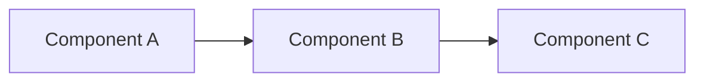

# Research: {Task Name}

**Date**: YYYY-MM-DD  
**Agent**: research.agent  
**Status**: In Progress / Complete  
**Related Plan**: `.github/plans/in-progress/{major-area}/{task-name}/`

---

## 1. Context & Goals

### Business Objective

{Why are we doing this? What problem does it solve for users/business?}

### Technical Goals

- {Goal 1: e.g., Improve performance by 50%}
- {Goal 2: e.g., Add real-time sync capability}
- {Goal 3: e.g., Reduce technical debt in auth module}

### Success Criteria

- [ ] {Criterion 1}
- [ ] {Criterion 2}
- [ ] {Criterion 3}

### Constraints

- {Constraint 1: e.g., Must maintain backward compatibility}
- {Constraint 2: e.g., Budget limit: X hours}
- {Constraint 3: e.g., Must use existing infrastructure}

---

## 2. Codebase Analysis

### Existing Patterns

**Architecture**:
{Current architectural approach, patterns used}

**Key Components**:

- `{file/module}`: {What it does}
- `{file/module}`: {What it does}

**Data Flow**:



### Affected Files

| File               | Current Role  | Impact Level | Change Type      |
| ------------------ | ------------- | ------------ | ---------------- |
| `path/to/file1.ts` | {Description} | 🔴 High      | Modify           |
| `path/to/file2.ts` | {Description} | 🟡 Medium    | Refactor         |
| `path/to/file3.ts` | {Description} | 🟢 Low       | No change needed |

### Technical Debt

- {Issue 1: e.g., Tight coupling between modules}
- {Issue 2: e.g., Missing tests in critical path}
- {Issue 3: e.g., Deprecated dependencies}

### Conventions Discovered

**Code Style**:

- {Convention 1: e.g., PascalCase for components}
- {Convention 2: e.g., Async functions always return promises}

**Testing Patterns**:

- {Pattern 1: e.g., Jest for unit tests}
- {Pattern 2: e.g., Test factories in test/factories/}

**Documentation Standards**:

- {Standard 1: e.g., JSDoc for all public functions}
- {Standard 2: e.g., README in each module}

---

## 3. Alternative Analysis

### Alternative Matrix

| Approach             | Principles Alignment | Pros                                | Cons                                | Risks        | Est. Effort  | Recommendation |
| -------------------- | -------------------- | ----------------------------------- | ----------------------------------- | ------------ | ------------ | -------------- |
| **A. {Option Name}** | High                 | - {Pro 1}<br>- {Pro 2}<br>- {Pro 3} | - {Con 1}<br>- {Con 2}              | {Risk level} | {Hours/Days} | ⚠️ Consider    |
| **B. {Option Name}** | Medium               | - {Pro 1}<br>- {Pro 2}              | - {Con 1}<br>- {Con 2}<br>- {Con 3} | {Risk level} | {Hours/Days} | ✅ RECOMMENDED |
| **C. {Option Name}** | Low                  | - {Pro 1}                           | - {Con 1}<br>- {Con 2}<br>- {Con 3} | {Risk level} | {Hours/Days} | ❌ Reject      |

### Detailed Analysis

#### Approach A: {Name}

**Description**: {Detailed explanation of this approach}

**Technical Considerations**:

- {Consideration 1}
- {Consideration 2}

**Implementation Path**:

1. {Step 1}
2. {Step 2}
3. {Step 3}

**Example**:

```typescript
// Code example showing how this would work
```

**Alignment with Project Principles**:

- ✅ {Principle 1}: Fully aligned
- ⚠️ {Principle 2}: Partial alignment
- ❌ {Principle 3}: Does not align

---

#### Approach B: {Name} ⭐ RECOMMENDED

**Description**: {Detailed explanation of this approach}

**Technical Considerations**:

- {Consideration 1}
- {Consideration 2}

**Implementation Path**:

1. {Step 1}
2. {Step 2}
3. {Step 3}

**Example**:

```typescript
// Code example showing how this would work
```

**Alignment with Project Principles**:

- ✅ {Principle 1}: Fully aligned
- ✅ {Principle 2}: Fully aligned
- ⚠️ {Principle 3}: Partial alignment with mitigation

**Why Recommended**:
{Clear rationale for why this is the best choice}

---

#### Approach C: {Name}

**Description**: {Detailed explanation of this approach}

**Technical Considerations**:

- {Consideration 1}
- {Consideration 2}

**Implementation Path**:

1. {Step 1}
2. {Step 2}

**Why Rejected**:
{Clear rationale for why this option was not chosen}

---

## 4. External Discovery

### Library/Framework Research

#### {Library Name} (v{version})

**Source**: [{Documentation}](url)  
**Last Updated**: YYYY-MM-DD  
**License**: {License type}  
**Community**: {Stars/Downloads/Activity level}

**Key Features**:

- {Feature 1}
- {Feature 2}
- {Feature 3}

**Relevant to This Task**:

- {How it helps}
- {Integration approach}

**Concerns**:

- {Any issues or limitations}

---

#### {Library Name} (v{version})

**Source**: [{Documentation}](url)  
**Last Updated**: YYYY-MM-DD  
**License**: {License type}  
**Community**: {Stars/Downloads/Activity level}

**Key Features**:

- {Feature 1}
- {Feature 2}

**Why Not Selected**:

- {Reason}

---

### Best Practices Research

**Source**: [{Article/Blog Title}](url)

**Key Findings**:

- {Finding 1}
- {Finding 2}
- {Finding 3}

**Applicability**: {How this applies to our task}

---

### Similar Implementations

**Project**: [{Name}](github-url)

**Approach**: {How they solved a similar problem}

**Lessons Learned**:

- {Lesson 1}
- {Lesson 2}

---

## 5. Proof of Concept

### POC Files (Temporary)

> ⚠️ All POC files listed below have been DELETED after validation

- [x] ~~`/tmp/poc-feature.ts`~~ - Deleted
- [x] ~~`/tmp/test-approach.ts`~~ - Deleted

### POC Results

**Test**: {What was tested}  
**Result**: ✅ Success / ⚠️ Partial / ❌ Failed  
**Finding**: {What we learned}

---

## 6. Risk Assessment

| Risk                         | Impact | Likelihood | Mitigation Strategy | Owner       | Status     |
| ---------------------------- | ------ | ---------- | ------------------- | ----------- | ---------- |
| {Risk 1: e.g., Breaking API} | High   | Medium     | {How to mitigate}   | {Team/Role} | Identified |
| {Risk 2}                     | Medium | Low        | {How to mitigate}   | {Team/Role} | Mitigated  |
| {Risk 3}                     | Low    | High       | {How to mitigate}   | {Team/Role} | Accepted   |

---

## 7. Recommendation

### Selected Approach

**Approach B: {Name}**

### Rationale

{Comprehensive explanation of why this is the best choice, referencing:

- Decision drivers
- Technical feasibility
- Alignment with project goals
- Risk/reward balance
- Team capability}

### Trade-offs Accepted

- {Trade-off 1: e.g., Slightly higher complexity for better performance}
- {Trade-off 2: e.g., More upfront work but easier maintenance}

### Next Steps

1. ✅ Research complete → Create `4-SPEC.md`
2. ⏭️ Get stakeholder approval on recommendation
3. ⏭️ Proceed to specification phase

---

## 8. Open Questions

- [ ] {Question 1 that needs clarification}
- [ ] {Question 2 that needs stakeholder input}
- [x] ~~{Resolved question}~~ - Answer: {…}

---

## 9. References

### Internal Documentation

- [{Doc name}](path/to/doc.md)
- [{File}](path/to/file.ts)

### External Resources

- [{Resource title}](url) - {Brief note}
- [{Resource title}](url) - {Brief note}

### Tools Used

- **MCP Servers**: Context7, Playwright, Chrome DevTools
- **Analysis Tools**: {List any tools used for analysis}

---

## Metadata

**Research Duration**: {X hours/days}  
**Files Analyzed**: {Count}  
**External Sources**: {Count}  
**Alternatives Evaluated**: {Count}  
**Updated**: YYYY-MM-DD HH:MM
