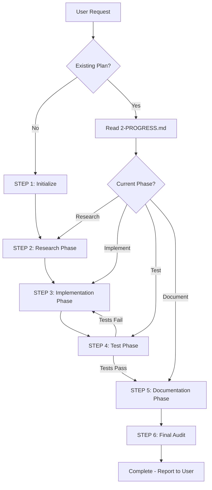

# PDD Workflow Patterns

## The Orchestration Pipeline

Plan-Driven Development follows a structured 6-step pipeline. Each step must complete before proceeding to the next:

```markdown
1. Initialize (Create PDD structure)
2. Research Phase (investigation & specification)
3. Implementation Phase (code changes)
4. Test Phase (validation & QA)
5. Documentation Phase (docs & diagrams)
6. Final Audit (quality verification)
```

## Step-by-Step Orchestration

### STEP 1: Initialize

**New Task?** → Create plan directory structure
**Existing Task?** → Read current state from `2-PROGRESS.md`

```markdown
1. Determine if task is new or resuming:

   - Search for existing plan in `.github/plans/in-progress/`
   - If not found → Create new plan directory
   - If found → Resume from current state

2. For new tasks:

   - Create `.github/plans/in-progress/{major-area}/{task-name}/`
   - Initialize `1-OVERVIEW.md` (use template from assets/)
   - Initialize `2-PROGRESS.md` (use template from assets/)
   - Initialize task tracking with phases

3. For existing tasks:
   - Read `2-PROGRESS.md` to determine current phase
   - Resume task tracking state
```

### STEP 2: Research Phase

**Sequential Process - Do NOT parallelize subagent calls**

```markdown
1. Invoke research.agent:

   - Provide absolute path to plan directory
   - Request: "Investigate {topic}. Create research findings, technical spec, and execution plan."

2. Wait for completion signal: "Research phase complete"

3. Verify outputs exist:

   - `3-RESEARCH.md` (investigation findings)
   - `4-SPEC.md` (technical specification)
   - `5-PLAN.md` (implementation tasks)

4. Review with user (if changes are critical):

   - Present `4-SPEC.md` for approval
   - Present `5-PLAN.md` for review

5. Update task tracking:
   - Mark "Research" phase as completed
```

### STEP 3: Implementation Phase

**Iterative Process - Call implement.agent until all tasks complete**

```markdown
1. Invoke implement.agent:

   - Provide absolute path to plan directory
   - Request: "Execute the implementation plan at {path}."

2. Monitor progress after each invocation:

   - Read `2-PROGRESS.md` for status updates
   - Check for completion signals

3. Loop until complete:

   - If `2-PROGRESS.md` shows incomplete tasks → Re-invoke implement.agent
   - If all tasks marked complete → Proceed to Test Phase

4. Update task tracking:
   - Mark individual tasks as completed during implementation
```

### STEP 4: Test Phase

**Conditional Workflow - May loop back to Implementation**

```markdown
1. Invoke test.agent:

   - Provide absolute path to plan directory
   - Request: "Validate the implementation with comprehensive tests."

2. Evaluate test results:
   **Tests PASS?** → Proceed to STEP 5 (Documentation)
   **Tests FAIL?** → Return to STEP 3 (Implementation)

3. For test failures:

   - Review failure details from test.agent
   - Re-invoke implement.agent with fix instructions
   - Return to test phase after fixes

4. Update task tracking:
   - Mark "Test" phase as completed (only when tests pass)
```

### STEP 5: Documentation Phase

**Multi-Output Process**

```markdown
1. Invoke document.agent:

   - Provide absolute path to plan directory
   - Explicit instruction: "Generate architecture diagrams (Mermaid), update API docs, and sync the README."

2. Verify documentation outputs:

   - Architecture diagrams in `docs/architecture/diagrams/`
   - API documentation updated
   - README.md reflects changes
   - All code properly documented

3. Update task tracking:
   - Mark "Document" phase as completed
```

### STEP 6: Final Audit

**Quality Verification Checklist**

```markdown
Before declaring task complete, verify:

Progress Status:

- [ ] `2-PROGRESS.md` shows status `finished`
- [ ] All subagent completion signals present

Code Quality:

- [ ] All implementation tasks complete per `5-PLAN.md`
- [ ] Tests pass (test agent confirmed)
- [ ] No compilation/lint errors

Documentation:

- [ ] Architecture diagrams created/updated
- [ ] API documentation current
- [ ] README.md reflects changes
- [ ] Code comments/JSDoc complete

Cleanup:

- [ ] Temporary POC files removed
- [ ] Debug code removed
- [ ] No commented-out code blocks

Task Completion:

- [ ] Update task tracking: Mark "Final Audit" complete
- [ ] Report completion to user
- [ ] Note: User manually archives plan to `.github/plans/finished/`
```

## Conditional Decision Points

### Resuming vs Starting Fresh

**Scenario**: User requests work on a feature

```markdown
1. Check for existing plan:
   **Plan exists?** → Resume workflow
   **No plan?** → Start fresh with STEP 1

2. Resume workflow:
   - Read `2-PROGRESS.md` to identify current phase
   - Jump to appropriate step (Research, Implement, Test, Document)
   - Continue from where previous work stopped
```

### Handling Test Failures

**Scenario**: Tests fail during STEP 4

```markdown
1. Test agent reports failures
2. Determine severity:
   **Critical failures?** → Return to STEP 3 (Implementation)
   **Minor issues?** → Return to STEP 3 (Implementation)

3. Implementation phase with fixes:

   - Invoke implement.agent with specific failure details
   - Request: "Fix the following test failures: {details}"

4. After fixes:
   - Return to STEP 4 (Test Phase)
   - Re-run tests to validate fixes
```

### Destructive Changes

**Scenario**: Implementation involves risky changes

```markdown
1. Research agent identifies high-risk changes:

   - Database schema modifications
   - Deleting significant code
   - Refactoring core modules
   - Changing external contracts

2. Conditional path:
   **High risk detected?** → Require DAP (Destructive Action Plan)
   **Low risk?** → Proceed normally

3. DAP workflow:
   - Research agent creates DAP using template
   - User must review and approve DAP
   - Implementation proceeds only after approval
```

## Subagent Invocation Pattern

**CRITICAL**: Always invoke subagents sequentially, never in parallel

```markdown
1. Prepare invocation:

   - Gather absolute path to plan directory
   - Compose clear, plain-language prompt
   - Specify expected outputs

2. Invoke subagent:

   - Use #tool:agent
   - Provide context: "The plan directory is at {absolute-path}"
   - State objective clearly

3. Wait for completion:

   - Do NOT invoke next subagent until current completes
   - Do NOT parallelize subagent calls
   - Review outputs before proceeding

4. Verify outputs:
   - Check that subagent completed its duties
   - Validate file updates in plan directory
   - Confirm completion signals
```

### Example Invocations

**Research Agent**:

```
"Investigate the authentication system in the codebase. The plan directory is at /absolute/path/to/.github/plans/in-progress/auth/oauth-integration. Analyze the current implementation, evaluate OAuth 2.0 integration options, and create research findings, technical spec, and implementation plan."
```

**Implement Agent**:

```
"Execute the implementation plan for OAuth integration. The plan directory is at /absolute/path/to/.github/plans/in-progress/auth/oauth-integration. Follow the tasks in 5-PLAN.md sequentially and update 2-PROGRESS.md after each task."
```

**Test Agent**:

```
"Validate the OAuth integration implementation with comprehensive tests. The plan directory is at /absolute/path/to/.github/plans/in-progress/auth/oauth-integration. Run all tests, check coverage, and report results."
```

**Document Agent**:

```
"Update all documentation for the OAuth integration feature. The plan directory is at /absolute/path/to/.github/plans/in-progress/auth/oauth-integration. Generate architecture diagrams, update API docs, and sync the README."
```

## Failure Recovery Patterns

### Subagent Failure

```markdown
1. Subagent returns error or incomplete output
2. Review the failure:

   - What went wrong?
   - What information is missing?
   - What context was unclear?

3. Decide on recovery:
   **Unclear requirements?** → Ask user for clarification
   **Missing context?** → Provide additional context and re-invoke
   **Tool unavailable?** → Report to user immediately (fail fast)

4. Re-invoke with corrections:
   - Enhanced prompt with more context
   - Specific guidance on what failed
   - Do NOT move to next phase until current succeeds
```

### Critical Tool Unavailable

```markdown
1. Detect that #tool:agent is unavailable
2. Immediately stop orchestration
3. Report to user:
   "Cannot proceed: The subagent tool is unavailable. PDD orchestration requires the ability to delegate to specialized subagents."
4. Do NOT attempt workarounds
```

## Task Tracking Integration

Throughout the workflow, maintain task tracking:

```markdown
Phase: Initialize

- Create todo list with all phases
- Mark "Initialize" as in-progress → Start work → Mark completed

Phase: Research

- Mark "Research" as in-progress → Invoke research.agent → Mark completed

Phase: Implement

- Mark "Implement" as in-progress → Loop with implement.agent → Mark completed

Phase: Test

- Mark "Test" as in-progress → Invoke test.agent → If pass, mark completed → If fail, return to Implement

Phase: Document

- Mark "Document" as in-progress → Invoke document.agent → Mark completed

Phase: Final Audit

- Mark "Final Audit" as in-progress → Run verification checklist → Mark completed
```

## Workflow Visualization



## Best Practices

### Do's ✅

- Read orchestration skill at start of each task
- Invoke subagents sequentially, one at a time
- Wait for completion before proceeding
- Verify outputs after each phase
- Update task tracking consistently
- Use absolute paths in subagent prompts
- Fail fast when tools unavailable

### Don'ts ❌

- Never edit source code yourself
- Never parallelize subagent calls
- Never skip PDD structure creation
- Never proceed without verification
- Never guess file paths
- Never hallucinate code
- Never batch task tracking updates
