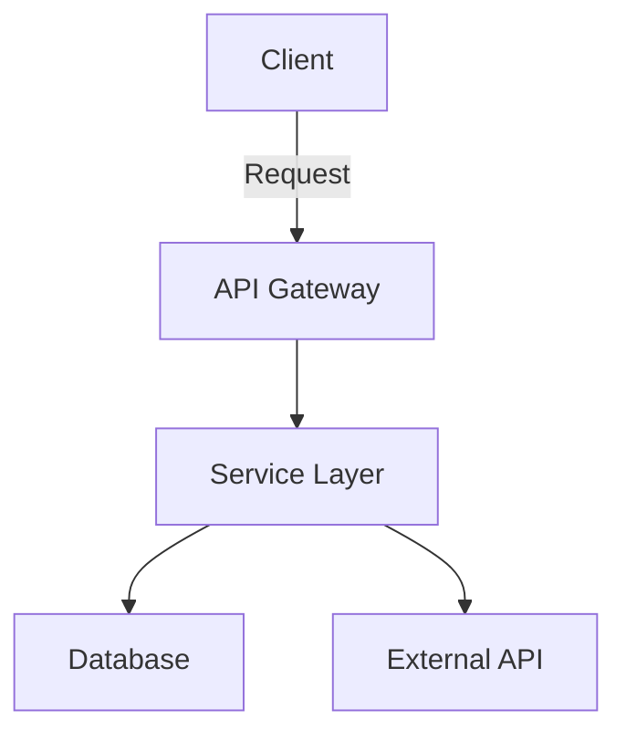
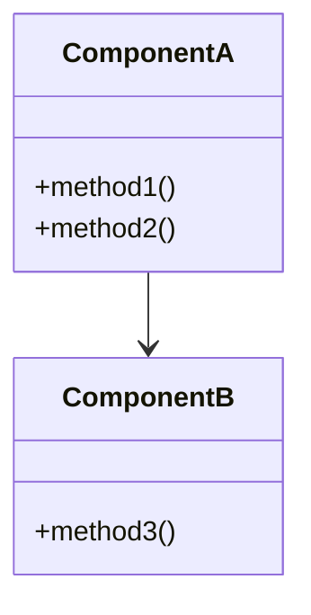
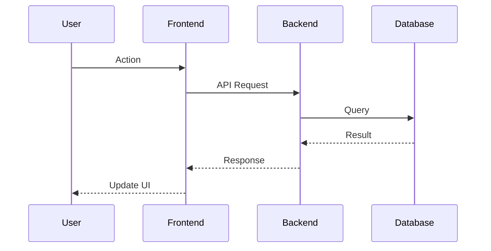

# Technical Specification: {Feature Name}

**Date**: YYYY-MM-DD  
**Agent**: research.agent  
**Status**: Draft / Under Review / Approved / Implemented  
**Related Plan**: `.github/plans/in-progress/{major-area}/{task-name}/`  
**Based on Research**: `3-RESEARCH.md`

---

## 1. Executive Summary

### What are we building?

{One-paragraph summary of the feature/change}

### Why?

{Business justification and user value}

### Success Metrics

- {Metric 1: e.g., Reduce API latency to < 100ms}
- {Metric 2: e.g., Increase user engagement by 20%}
- {Metric 3: e.g., Zero production incidents in first month}

---

## 2. Architecture Design

### System Overview



### Component Diagram



### Data Flow



### Key Architectural Decisions

**Decision 1**: {Decision name}

- **Rationale**: {Why this choice}
- **Alternatives Considered**: {What else was evaluated}
- **Trade-offs**: {What we're giving up}

**Decision 2**: {Decision name}

- **Rationale**: {Why this choice}
- **Alternatives Considered**: {What else was evaluated}
- **Trade-offs**: {What we're giving up}

---

## 3. API / Interface Changes

### New Interfaces

```typescript
/**
 * {Description of interface}
 */
interface NewInterface {
  /**
   * {Field description}
   */
  field1: string;

  /**
   * {Field description}
   */
  field2: number;

  /**
   * {Method description}
   * @param param1 - {Description}
   * @returns {Description}
   */
  method1(param1: string): Promise<ReturnType>;
}
```

### Modified Interfaces

```typescript
// BEFORE
interface ExistingInterface {
  oldField: string;
}

// AFTER
interface ExistingInterface {
  oldField: string; // ⚠️ Deprecated - use newField
  newField: string; // ✨ New field
}
```

### API Endpoints

#### New Endpoints

**POST** `/api/v1/{resource}`

**Description**: {What this endpoint does}

**Request**:

```json
{
  "field1": "value",
  "field2": 123
}
```

**Response** (200 OK):

```json
{
  "id": "uuid",
  "status": "success",
  "data": {
    "field1": "value"
  }
}
```

**Error Responses**:

- `400 Bad Request`: Invalid input
- `401 Unauthorized`: Missing/invalid authentication
- `404 Not Found`: Resource not found
- `500 Internal Server Error`: Server error

---

#### Modified Endpoints

**GET** `/api/v1/{resource}`

**Changes**:

- ✨ Added query parameter: `filter`
- ⚠️ Deprecated query parameter: `oldFilter` (will be removed in v2)
- 🔄 Response format updated to include `metadata`

**Before**:

```json
{
  "items": [...]
}
```

**After**:

```json
{
  "items": [...],
  "metadata": {
    "total": 100,
    "page": 1
  }
}
```

---

## 4. Data Model Changes

### New Tables/Collections

**Table**: `{table_name}`

| Column       | Type         | Nullable | Default | Description        |
| ------------ | ------------ | -------- | ------- | ------------------ |
| `id`         | UUID         | No       | gen     | Primary key        |
| `field1`     | VARCHAR(255) | No       | -       | {Description}      |
| `field2`     | INTEGER      | Yes      | NULL    | {Description}      |
| `created_at` | TIMESTAMP    | No       | NOW()   | Creation timestamp |

**Indexes**:

- `idx_field1` on `field1` (for fast lookups)
- `idx_created_at` on `created_at` (for time-based queries)

---

### Modified Tables/Collections

**Table**: `{existing_table}`

**Changes**:

- ✨ Add column: `new_field` (VARCHAR(100), nullable)
- 🔄 Modify column: `existing_field` (increase size to VARCHAR(500))
- ⚠️ Deprecate column: `old_field` (will be removed in next major version)

**Migration Script**:

```sql
ALTER TABLE existing_table
  ADD COLUMN new_field VARCHAR(100);

ALTER TABLE existing_table
  ALTER COLUMN existing_field TYPE VARCHAR(500);
```

---

## 5. Implementation Steps

### Phase 1: Foundation

**Goal**: Set up core infrastructure

**Tasks**:

1. Create database schema
2. Implement data access layer
3. Set up API routes
4. Add authentication/authorization

**Deliverables**:

- [ ] Database migrations
- [ ] Repository classes
- [ ] API endpoints (stub implementations)
- [ ] Auth middleware

**Estimated Effort**: {X hours/days}

---

### Phase 2: Core Logic

**Goal**: Implement business logic

**Tasks**:

1. Implement service layer
2. Add validation logic
3. Integrate external dependencies
4. Error handling

**Deliverables**:

- [ ] Service implementations
- [ ] Input validators
- [ ] External API integrations
- [ ] Error handling middleware

**Estimated Effort**: {X hours/days}

---

### Phase 3: Polish & Optimization

**Goal**: Optimize and refine

**Tasks**:

1. Performance optimization
2. Add caching layer
3. Logging and monitoring
4. Documentation

**Deliverables**:

- [ ] Performance benchmarks met
- [ ] Caching implemented
- [ ] Logging/metrics added
- [ ] API documentation complete

**Estimated Effort**: {X hours/days}

---

## 6. Impact Analysis

### Files to Create

| File Path                     | Purpose       | Size Est. | Priority |
| ----------------------------- | ------------- | --------- | -------- |
| `src/api/new-endpoint.ts`     | {Description} | ~200 LOC  | P0       |
| `src/services/new.service.ts` | {Description} | ~150 LOC  | P0       |
| `test/api/new.test.ts`        | {Description} | ~300 LOC  | P0       |

### Files to Modify

| File Path             | Current Role  | Changes Needed         | Risk   |
| --------------------- | ------------- | ---------------------- | ------ |
| `src/api/router.ts`   | {Description} | Add new routes         | 🟢 Low |
| `src/db/schema.ts`    | {Description} | Add new tables         | 🟡 Med |
| `src/config/index.ts` | {Description} | Add new config options | 🟢 Low |

### Files to Delete

| File Path               | Reason                           | Replacement      |
| ----------------------- | -------------------------------- | ---------------- |
| `src/legacy/old-api.ts` | Superseded by new implementation | `src/api/new.ts` |

---

### Dependencies

**New Dependencies**:

```json
{
  "package-name": "^1.2.3", // {Why needed}
  "another-package": "^2.0.0" // {Why needed}
}
```

**Updated Dependencies**:

```json
{
  "existing-package": "^2.0.0" // Updated from 1.x for {reason}
}
```

---

### Breaking Changes

#### Change 1: {Description}

**Impact**: {Who/what is affected}

**Before**:

```typescript
// Old API
oldFunction(param: string): void
```

**After**:

```typescript
// New API
newFunction(param: string): Promise<Result>
```

**Migration Path**:

1. {Step 1}
2. {Step 2}
3. {Step 3}

**Deprecation Timeline**:

- v1.5: Add new API, deprecate old API
- v1.6-v1.9: Support both (with warnings)
- v2.0: Remove old API

---

## 7. Testing Strategy

### Unit Tests

**Coverage Target**: 85%+

**Focus Areas**:

- Core business logic
- Edge cases and error conditions
- Input validation
- Data transformations

**Test Files**:

- `test/unit/service.test.ts` (~20 test cases)
- `test/unit/validator.test.ts` (~15 test cases)
- `test/unit/transformer.test.ts` (~10 test cases)

---

### Integration Tests

**Focus Areas**:

- API endpoint behavior
- Database interactions
- External API integrations
- Authentication/authorization

**Test Files**:

- `test/api/endpoints.test.ts` (~15 test cases)
- `test/integration/db.test.ts` (~10 test cases)
- `test/integration/external.test.ts` (~5 test cases)

---

### E2E Tests

**Critical User Paths**:

1. **Happy Path**: {Description of success scenario}
   - Setup: {Preconditions}
   - Steps: {User actions}
   - Expected: {Outcome}

2. **Error Path**: {Description of failure scenario}
   - Setup: {Preconditions}
   - Steps: {User actions}
   - Expected: {Error handling}

**Test Files**:

- `test/e2e/user-flow.spec.ts` (~3-5 scenarios)

---

### Test Data Strategy

**Fixtures**:

- `test/fixtures/users.json` - Sample user data
- `test/fixtures/resources.json` - Sample resource data

**Factories**:

- `test/factories/user.factory.ts` - Generate test users
- `test/factories/resource.factory.ts` - Generate test resources

**Database State**:

- Use test database with clean state per test
- Reset after each test suite
- No dependencies on production data

---

## 8. Security Considerations

### Authentication

- {How users/systems authenticate}
- {Token/session management}

### Authorization

- {Access control model}
- {Permission checks}

### Data Protection

- {Sensitive data handling}
- {Encryption at rest/in transit}
- {PII considerations}

### Input Validation

- {Validation rules}
- {Sanitization approach}
- {XSS/SQL injection prevention}

### Rate Limiting

- {Rate limits per endpoint}
- {Throttling strategy}

---

## 9. Performance Considerations

### Expected Load

- **Requests/sec**: {Number}
- **Concurrent Users**: {Number}
- **Data Volume**: {Size}

### Performance Targets

- **API Response Time**: < {X}ms (p95)
- **Database Query Time**: < {X}ms (p95)
- **Throughput**: {X} req/sec

### Optimization Strategies

- {Strategy 1: e.g., Add caching layer}
- {Strategy 2: e.g., Database indexing}
- {Strategy 3: e.g., Batch operations}

### Monitoring

- {Metrics to track}
- {Alerting thresholds}
- {Dashboard/logging approach}

---

## 10. Rollout Plan

### Phase 1: Internal Testing

- **Duration**: {X days}
- **Audience**: Dev team only
- **Success Criteria**: {Criteria}

### Phase 2: Beta Release

- **Duration**: {X days}
- **Audience**: {Select users/groups}
- **Success Criteria**: {Criteria}
- **Rollback Trigger**: {Conditions for rollback}

### Phase 3: General Availability

- **Date**: YYYY-MM-DD
- **Communication**: {How users will be notified}
- **Support Plan**: {How issues will be handled}

---

## 11. Acceptance Criteria

### Functional Requirements

- [ ] {Requirement 1}
- [ ] {Requirement 2}
- [ ] {Requirement 3}

### Non-Functional Requirements

- [ ] Performance targets met
- [ ] Security review passed
- [ ] Documentation complete
- [ ] Tests passing with >80% coverage

### Definition of Done

- [ ] Code implemented and reviewed
- [ ] All tests passing (unit/integration/e2e)
- [ ] Documentation updated
- [ ] Performance benchmarks met
- [ ] Security scan clean
- [ ] Ready for production deployment

---

## 12. Risks and Mitigation

| Risk     | Impact | Likelihood | Mitigation Strategy | Owner       | Status     |
| -------- | ------ | ---------- | ------------------- | ----------- | ---------- |
| {Risk 1} | High   | Medium     | {Mitigation}        | {Team/Role} | Monitoring |
| {Risk 2} | Medium | Low        | {Mitigation}        | {Team/Role} | Mitigated  |
| {Risk 3} | Low    | High       | {Mitigation}        | {Team/Role} | Accepted   |

---

## 13. Open Questions

- [ ] {Question 1 requiring clarification}
- [ ] {Question 2 requiring stakeholder decision}
- [x] ~~{Resolved question}~~ - Answer: {…}

---

## 14. References

### Related Documentation

- [Research Document](3-RESEARCH.md)
- [Implementation Tasks](5-TASKS.md)
- [{Other relevant doc}](path/to/doc.md)

### External Resources

- [{Library/Framework Docs}](url)
- [{Best Practices Guide}](url)
- [{Similar Implementation}](url)

---

## 15. Approval

### Reviewers

- [ ] **Technical Lead**: {Name} - Technical architecture review
- [ ] **Product Owner**: {Name} - Business requirements review
- [ ] **Security**: {Name} - Security review
- [ ] **DevOps**: {Name} - Infrastructure/deployment review

### Sign-off

**Approved by**: {Name}  
**Date**: YYYY-MM-DD  
**Status**: ✅ Approved to proceed with implementation

---

## Metadata

**Version**: 1.0  
**Last Updated**: YYYY-MM-DD  
**Next Review**: YYYY-MM-DD
