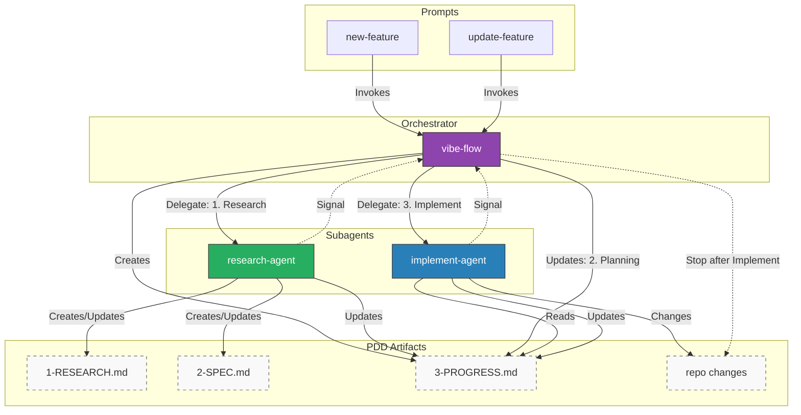
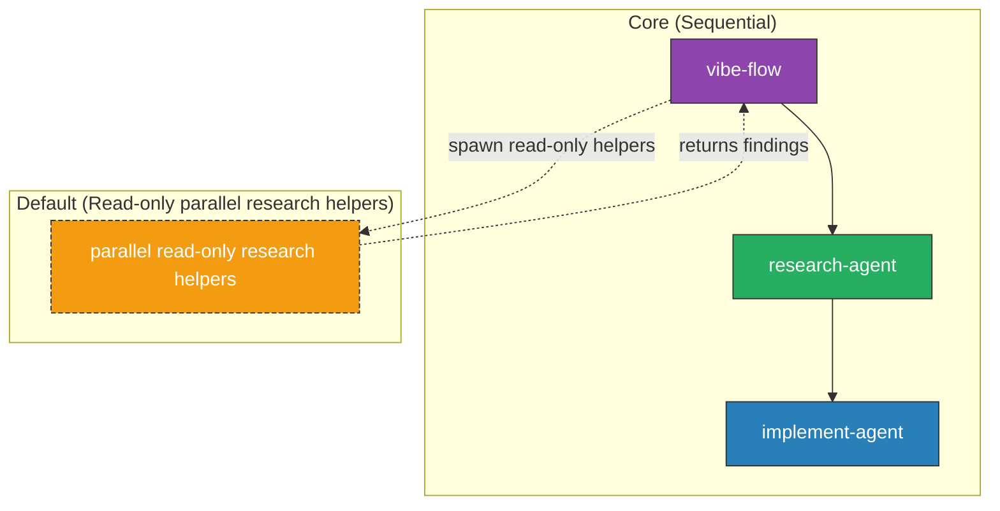

# Vibe Flow Agent Orchestrator

Plan-Driven Development (PDD) agent suite for managing complex software projects through a **research-first incremental workflow**.

**Tags:** github-copilot, agents, orchestration, pdd, project-management, testing, documentation

_Heavily Inspired by AlignFirst V1 (https://github.com/paleo/alignfirst/blob/v1/README.md)_

## 🎯 What is Vibe Flow?

Vibe Flow is a complete agent-based development framework that transforms how you build software. This repo is currently in **incremental mode** to let you validate each phase before adding more subagents.

1. **Research** → Investigate and specify
2. **Orchestrator Planning** → Break down into tasks
3. **Implement** → Execute with verification
4. **(Next)** Test → Validate with comprehensive QA
5. **(Next)** Document → Update architecture & guides

All work is tracked in `.github/plans/` directories, creating a permanent memory of your project's evolution.

## � Workflow Diagram


```mermaid
graph TD
    subgraph "Prompts"
        NF[new-feature]
        UF[update-feature]
    end

    subgraph "Orchestrator"
        VF[vibe-flow]
    end

    subgraph "Subagents"
        RA[research-agent]
        IA[implement-agent]
    end

    subgraph "PDD Artifacts"
        F1[1-RESEARCH.md]
        F2[2-SPEC.md]
        F3[3-PROGRESS.md]
        CODE[repo changes]
    end

    NF & UF -->|Invokes| VF

    %% Orchestrator inits
    VF -->|Creates| F3

    VF -->|Delegate: 1. Research| RA
    RA -->|Creates/Updates| F1
    RA -->|Creates/Updates| F2
    RA -->|Updates| F3
    RA -.->|Signal| VF

    VF -->|Updates: 2. Planning| F3

    VF -->|Delegate: 3. Implement| IA
    IA -->|Reads| F3
    IA -->|Updates| F3
    IA -->|Changes| CODE
    IA -.->|Signal| VF

    VF -.->|Stop after Implement| CODE

    style VF fill:#8e44ad,stroke:#333,color:#fff
    style RA fill:#27ae60,stroke:#333,color:#fff
    style IA fill:#2980b9,stroke:#333,color:#fff

    style F1 fill:#f9f9f9,stroke:#666,stroke-dasharray: 5 5
    style F2 fill:#f9f9f9,stroke:#666,stroke-dasharray: 5 5
    style F3 fill:#f9f9f9,stroke:#666,stroke-dasharray: 5 5
    style CODE fill:#f9f9f9,stroke:#666,stroke-dasharray: 5 5
```

### Parallel subagents (v2, default read-only)

In v2, the core workflow remains sequential: `vibe-flow` → `research-agent` → `implement-agent`. By default, `vibe-flow` can also spawn parallel **read-only research helpers** to scan code or gather context. These helpers never edit files or plan artifacts; they return notes to `vibe-flow`, which remains the single writer.


```mermaid
flowchart TD
    subgraph "Core (Sequential)"
        VF[vibe-flow] --> RA[research-agent]
        RA --> IA[implement-agent]
    end

    subgraph "Default (Read-only parallel research helpers)"
        VF -.->|spawn read-only helpers| PR[parallel read-only research helpers]
        PR -.->|returns findings| VF
    end

    style VF fill:#8e44ad,stroke:#333,color:#fff
    style RA fill:#27ae60,stroke:#333,color:#fff
    style IA fill:#2980b9,stroke:#333,color:#fff
    style PR fill:#f39c12,stroke:#333,color:#fff,stroke-dasharray: 4 2
```

## 🚀 Quick Start

Vibe Flow is distributed as an [APM](https://github.com/microsoft/apm) package.

### Install APM

```bash
# macOS / Linux
curl -sSL https://aka.ms/apm-unix | sh

# Windows (PowerShell)
irm https://aka.ms/apm-windows | iex
```

### Install Vibe Flow

In any repository:

```bash
apm install sammykumar/vibe-flow-agent-orchestrator
```

APM deploys agents, skills, and prompts directly into `.github/agents/`, `.github/skills/`, and `.github/prompts/` — the native directories GitHub Copilot reads from.

### Update

```bash
apm install --update sammykumar/vibe-flow-agent-orchestrator
```

### Uninstall

```bash
apm uninstall sammykumar/vibe-flow-agent-orchestrator
```

### Pin to a version

Add to your project's `apm.yml`:

```yaml
dependencies:
  apm:
    - sammykumar/vibe-flow-agent-orchestrator#v3.6.0
```

Then run `apm install` to sync.

## 🤖 Agents Included

Once installed, Vibe Flow provides:

### Main Orchestrator

- **@vibe-flow** - The master orchestrator that manages the PDD lifecycle, delegates to subagents, and maintains project state

### Specialized Subagents

| Agent               | Role                          | Responsibilities                                                           |
| ------------------- | ----------------------------- | -------------------------------------------------------------------------- |
| **research-agent**  | Investigation & Specification | Analyzes codebases, authors technical specs, evaluates alternatives        |
| **implement-agent** | Implementation & Verification | Executes tasks, applies code changes, runs happy-path checks, logs results |

## 📂 Project Structure Created

After installation, your repository will have:

```
.github/
├── agents/                    # All Vibe Flow agents
│   ├── vibe-flow.agent.md    # Main orchestrator
│   ├── research.agent.md     # Research specialist
│   └── implement.agent.md    # Implementation specialist
└── plans/                     # Project memory (PDD)
    ├── todo/                  # Planned work
    ├── in-progress/           # Active tasks
    └── finished/              # Completed work

docs/
├── vibeflow/
│   ├── pdd-protocol.md       # PDD rules & standards
│   └── orchestrator-manual.md # Usage guide
├── guides/                    # Development guides
└── architecture/              # Diagrams & ADRs
```

## 💡 Usage

Once installed, start any complex task with:

```
@vibe-flow Implement user authentication with JWT tokens
```

The orchestrator will:

1. ✅ Create a plan structure in `.github/plans/in-progress/`
2. ✅ Delegate to **research-agent** for investigation
3. ✅ Author task breakdown in `3-PROGRESS.md` in **vibe-flow** from research/spec outputs
4. ✅ Delegate to **implement-agent** after approval
5. ✅ Stop after implementation and prompt you to add the next subagent

## 🔄 Version Management

Current Version: **3.6.0** (Single source of truth in `vibe-flow.agent.md` and `apm.yml`)

All agents are versioned as a suite. When you update Vibe Flow, all agents update together to maintain compatibility.

### Check for Updates

```bash
apm install --update sammykumar/vibe-flow-agent-orchestrator
```

## 📖 Documentation

- **[PDD Protocol](docs/vibeflow/pdd-protocol.md)** - The rules for Plan-Driven Development
- **[Orchestrator Manual](docs/vibeflow/orchestrator-manual.md)** - Detailed usage guide
- **[Development Guide](.github/copilot-instructions.md)** - For contributors to this repository

## 🧩 Skills Included

- **Orchestration** - PDD workflow and subagent delegation patterns with templates and workflow references. See [.github/skills/orchestration/SKILL.md](.github/skills/orchestration/SKILL.md).
- **Research** - Evidence-driven analysis and PDD deliverables for repository investigation. See [docs/vibeflow/research-skill.md](docs/vibeflow/research-skill.md).
- **Mermaid.js v11** - Diagram syntax, configuration, CLI workflows, and integration patterns. See [docs/vibeflow/mermaidjs-v11-skill.md](docs/vibeflow/mermaidjs-v11-skill.md).
- **Skills Creator** - Creating, packaging, and validating skills using agentskills.io spec. See [.github/skills/skills-creator/SKILL.md](.github/skills/skills-creator/SKILL.md).

## 🛠️ Development

This repository is the **source code** for Vibe Flow agents.

- **"Code"**: Markdown files (`*.agent.md`)
- **"Compiler"**: The LLM that interprets them
- **"Package Manager"**: [APM](https://github.com/microsoft/apm)

### Repository Structure

```
.apm/              # APM distribution source (what consumers receive)
  agents/          # Agent definitions
  skills/          # Skill packages
  prompts/         # Prompt templates
.github/           # Dogfood copies for developing in this repo
  agents/          # Deployed agent copies (VS Code reads these)
  skills/          # Deployed skill copies
  prompts/         # Deployed prompt copies
apm.yml            # APM package manifest
```

The `.apm/` directory is the **distribution source** — what APM reads when consumers run `apm install`.
The `.github/` copies are committed deployed files so contributors get context immediately on clone.

### Contributing

To modify agents or add features:

1. Edit files in **both** `.apm/agents/` (distribution source) and `.github/agents/` (dogfood copy)
2. Run `npm run sync` to copy `.github/` → `.apm/`
3. Run `npm run version:patch` (or `version:minor` / `version:major`) to bump `package.json` + `apm.yml`, commit, tag, and push

## 📜 License

MIT License - See LICENSE file for details

## 🙏 Acknowledgments

Built with ❤️ for the GitHub Copilot community.

Special thanks to the teams behind VS Code, GitHub Copilot, and the Model Context Protocol (MCP).

---

**Questions or Issues?** Open an issue in this repository or contact [@sammykumar](https://github.com/sammykumar).
