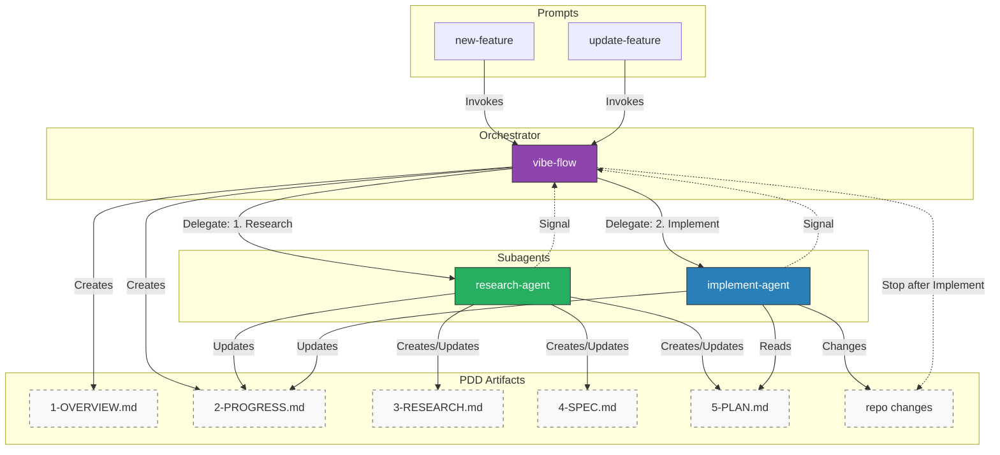
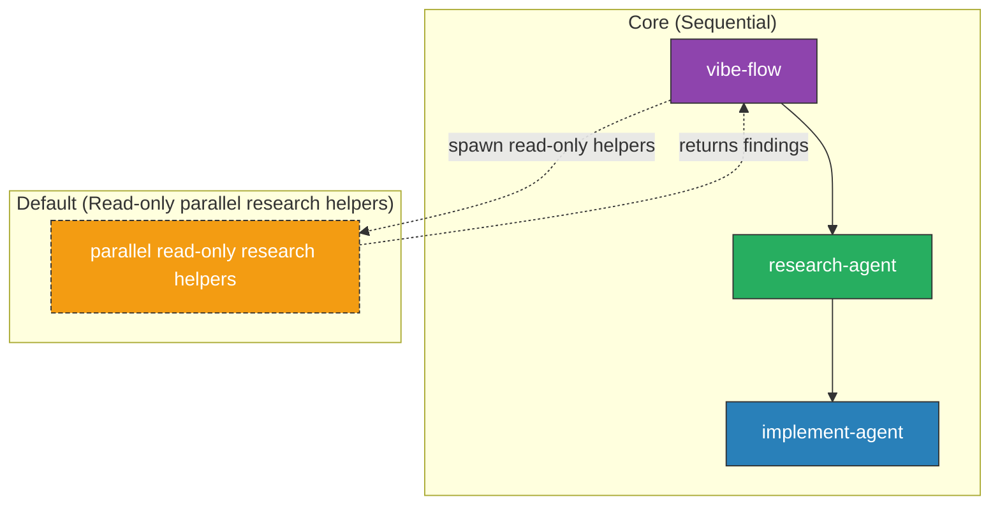

# Vibe Flow Agent Orchestrator

Plan-Driven Development (PDD) agent suite for managing complex software projects through a **research-first incremental workflow**.

**Tags:** github-copilot, agents, orchestration, pdd, project-management, testing, documentation

_Heavily Inspired by AlignFirst V1 (https://github.com/paleo/alignfirst/blob/v1/README.md)_

## 🎯 What is Vibe Flow?

Vibe Flow is a complete agent-based development framework that transforms how you build software. This repo is currently in **incremental mode** to let you validate each phase before adding more subagents.

1. **Research** → Investigate and specify
2. **Plan** → Break down into tasks
3. **Implement** → Execute with verification
4. **(Next)** Test → Validate with comprehensive QA
5. **(Next)** Document → Update architecture & guides

All work is tracked in `.github/plans/` directories, creating a permanent memory of your project's evolution.

## � Workflow Diagram



### Parallel subagents (v2, default read-only)

In v2, the core workflow remains sequential: `vibe-flow` → `research-agent` → `implement-agent`. By default, `vibe-flow` can also spawn parallel **read-only research helpers** to scan code or gather context. These helpers never edit files or plan artifacts; they return notes to `vibe-flow`, which remains the single writer.



## �🚀 Quick Start

| Action                  | Description                                                          | Install                                                                                                                                                                                                                                                                                                                                                                                                                                                                                                                                                                                                         |
| ----------------------- | -------------------------------------------------------------------- | --------------------------------------------------------------------------------------------------------------------------------------------------------------------------------------------------------------------------------------------------------------------------------------------------------------------------------------------------------------------------------------------------------------------------------------------------------------------------------------------------------------------------------------------------------------------------------------------------------------- |
| **Install Vibe Flow**   | Bootstrap the incremental Vibe Flow agent suite into your repository | [](vscode:chat-prompt/install?url=https%3A%2F%2Fraw.githubusercontent.com%2Fsammykumar%2Fvibe-flow-agent-orchestrator%2Fmain%2Finstall-vibeflow.md)<br />[](vscode-insiders:chat-prompt/install?url=https%3A%2F%2Fraw.githubusercontent.com%2Fsammykumar%2Fvibe-flow-agent-orchestrator%2Fmain%2Finstall-vibeflow.md)     |
| **Uninstall Vibe Flow** | Safely remove Vibe Flow from your repository (with backup options)   | [](vscode:chat-prompt/install?url=https%3A%2F%2Fraw.githubusercontent.com%2Fsammykumar%2Fvibe-flow-agent-orchestrator%2Fmain%2Funinstall-vibeflow.md)<br />[](vscode-insiders:chat-prompt/install?url=https%3A%2F%2Fraw.githubusercontent.com%2Fsammykumar%2Fvibe-flow-agent-orchestrator%2Fmain%2Funinstall-vibeflow.md) |

## 🤖 Agents Included

Once installed, Vibe Flow provides:

> Legacy full-suite agents are backed up in `.github/agents/v1/`.

### Main Orchestrator

- **@vibe-flow** - The master orchestrator that manages the PDD lifecycle, delegates to subagents, and maintains project state

### Specialized Subagents

| Agent               | Role                          | Responsibilities                                                                                  |
| ------------------- | ----------------------------- | ------------------------------------------------------------------------------------------------- |
| **research-agent**  | Investigation & Specification | Analyzes codebases, authors technical specs, evaluates alternatives, creates implementation plans |
| **implement-agent** | Implementation & Verification | Executes plans, applies code changes, runs happy-path checks, logs results                        |

## 📂 Project Structure Created

After installation, your repository will have:

```
.github/
├── agents/                    # All Vibe Flow agents
│   ├── vibe-flow.agent.md    # Main orchestrator
│   ├── research.agent.md     # Research specialist
│   └── implement.agent.md    # Implementation specialist
└── plans/                     # Project memory (PDD)
    ├── todo/                  # Planned work
    ├── in-progress/           # Active tasks
    └── finished/              # Completed work

docs/
├── vibeflow/
│   ├── pdd-protocol.md       # PDD rules & standards
│   └── orchestrator-manual.md # Usage guide
├── guides/                    # Development guides
└── architecture/              # Diagrams & ADRs
```

## 💡 Usage

Once installed, start any complex task with:

```
@vibe-flow Implement user authentication with JWT tokens
```

The orchestrator will:

1. ✅ Create a plan structure in `.github/plans/in-progress/`
2. ✅ Delegate to **research-agent** for investigation
3. ✅ Delegate to **implement-agent** after approval
4. ✅ Stop after implementation and prompt you to add the next subagent

## 🔄 Version Management

Current Version: **2.0.0** (Single source of truth in `vibe-flow.agent.md`)

All agents are versioned as a suite. When you update Vibe Flow, all agents update together to maintain compatibility.

### Check for Updates

Simply run the install prompt again - it will check GitHub for the latest version and update if needed.

## 📖 Documentation

- **[PDD Protocol](docs/vibeflow/pdd-protocol.md)** - The rules for Plan-Driven Development
- **[Orchestrator Manual](docs/vibeflow/orchestrator-manual.md)** - Detailed usage guide
- **[Development Guide](.github/copilot-instructions.md)** - For contributors to this repository

## 🧩 Skills Included

- **Orchestration** - PDD workflow and subagent delegation patterns with templates and workflow references. See [.github/skills/orchestration/SKILL.md](.github/skills/orchestration/SKILL.md).
- **Research** - Evidence-driven analysis and PDD deliverables for repository investigation. See [docs/vibeflow/research-skill.md](docs/vibeflow/research-skill.md).
- **Mermaid.js v11** - Diagram syntax, configuration, CLI workflows, and integration patterns. See [docs/vibeflow/mermaidjs-v11-skill.md](docs/vibeflow/mermaidjs-v11-skill.md).
- **Skills Creator** - Creating, packaging, and validating skills using agentskills.io spec. See [.github/skills/skills-creator/SKILL.md](.github/skills/skills-creator/SKILL.md).

## 🛠️ Development

This repository is the **source code** for Vibe Flow agents.

- **"Code"**: Markdown files (`*.agent.md`)
- **"Compiler"**: The LLM that interprets them
- **"Installer"**: `install-vibeflow.md` prompt
- **"Package Manager"**: VS Code Chat Prompt Install system

### Contributing

To modify agents or add features:

1. Edit agent files in `.github/agents/`
2. Update `install-vibeflow.md` if structure changes
3. Run `./version-bump.sh [major|minor|patch]`
4. Test in a target repository

See [.github/copilot-instructions.md](.github/copilot-instructions.md) for detailed development guidelines.

## 📜 License

MIT License - See LICENSE file for details

## 🙏 Acknowledgments

Built with ❤️ for the GitHub Copilot community.

Special thanks to the teams behind VS Code, GitHub Copilot, and the Model Context Protocol (MCP).

---

**Questions or Issues?** Open an issue in this repository or contact [@sammykumar](https://github.com/sammykumar).
