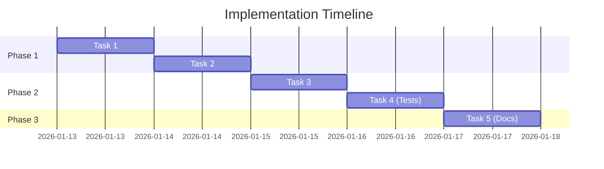

# Implementation Plan: {Feature Name}

**Date**: YYYY-MM-DD  
**Agent**: research.agent  
**Status**: Draft / Approved / In Progress / Complete  
**Related Plan**: `.github/plans/in-progress/{major-area}/{task-name}/`  
**Based on Spec**: `4-SPEC.md`

---

## Overview

### Goal

{One-line summary of what we're building}

### Approach

{Brief description of the chosen technical approach from research}

### Estimated Effort

**Total**: {X hours/days}  
**Complexity**: 🟢 Low / 🟡 Medium / 🔴 High

---

## Pre-Implementation Checklist

- [ ] Spec reviewed and approved (`4-SPEC.md`)
- [ ] Research findings validated (`3-RESEARCH.md`)
- [ ] Dependencies identified and available
- [ ] Test strategy defined
- [ ] Rollback plan in place (if high-risk)

---

## Implementation Tasks

### ✅ Task 1: {Task Name}

**Goal**: {What this task accomplishes}

**Files**:

- `path/to/file1.ts` (create)
- `path/to/file2.ts` (modify)

**Steps**:

1. {Step 1}
2. {Step 2}
3. {Step 3}

**Verification**:

- [ ] Run `get_errors` - must be clean
- [ ] Happy path test: {describe test}
- [ ] No regressions in existing tests

**Dependencies**: None / Requires Task X complete

**Estimated Time**: {X hours}

**Status**: ⬜ Not Started / 🔄 In Progress / ✅ Complete

**Notes**: {Any important context or decisions}

---

### ✅ Task 2: {Task Name}

**Goal**: {What this task accomplishes}

**Files**:

- `path/to/file3.ts` (create)
- `path/to/file4.ts` (modify)

**Steps**:

1. {Step 1}
2. {Step 2}
3. {Step 3}

**Verification**:

- [ ] Run `get_errors` - must be clean
- [ ] Happy path test: {describe test}
- [ ] Integration test passes

**Dependencies**: Requires Task 1 complete

**Estimated Time**: {X hours}

**Status**: ⬜ Not Started / 🔄 In Progress / ✅ Complete

**Notes**: {Any important context or decisions}

---

### ✅ Task 3: {Task Name}

**Goal**: {What this task accomplishes}

**Files**:

- `path/to/file5.ts` (create)
- `path/to/file6.ts` (modify)

**Steps**:

1. {Step 1}
2. {Step 2}
3. {Step 3}

**Verification**:

- [ ] Run `get_errors` - must be clean
- [ ] Happy path test: {describe test}
- [ ] Performance benchmark met

**Dependencies**: Requires Task 2 complete

**Estimated Time**: {X hours}

**Status**: ⬜ Not Started / 🔄 In Progress / ✅ Complete

**Notes**: {Any important context or decisions}

---

### ✅ Task 4: {Task Name} (Testing)

**Goal**: Add comprehensive test coverage

**Files**:

- `test/unit/feature.test.ts` (create)
- `test/integration/feature.test.ts` (create)
- `test/e2e/feature.spec.ts` (create)

**Steps**:

1. Write unit tests for core logic (target: >85% coverage)
2. Write integration tests for API endpoints
3. Write E2E tests for critical user paths

**Verification**:

- [ ] All tests pass
- [ ] Coverage target met (>80%)
- [ ] No flaky tests

**Dependencies**: Requires Tasks 1-3 complete

**Estimated Time**: {X hours}

**Status**: ⬜ Not Started / 🔄 In Progress / ✅ Complete

**Notes**: See test strategy in `4-SPEC.md` Section 7

---

### ✅ Task 5: {Task Name} (Documentation)

**Goal**: Update all relevant documentation

**Files**:

- `README.md` (update)
- `docs/api/endpoints.md` (update)
- `docs/guides/usage.md` (update)
- `docs/architecture/diagrams/flow.mmd` (create)

**Steps**:

1. Update README with new feature
2. Document new API endpoints
3. Create architecture diagram
4. Update usage guides

**Verification**:

- [ ] All links valid
- [ ] Code examples tested
- [ ] Diagrams render correctly

**Dependencies**: Requires Tasks 1-4 complete

**Estimated Time**: {X hours}

**Status**: ⬜ Not Started / 🔄 In Progress / ✅ Complete

**Notes**: Follow documentation standards in `docs/guides/writing-documentation.md`

---

## Risk Mitigation

### High-Risk Tasks

| Task   | Risk                    | Impact | Mitigation                     | Status       |
| ------ | ----------------------- | ------ | ------------------------------ | ------------ |
| Task 2 | Database schema change  | High   | Create rollback migration      | ✅ Mitigated |
| Task 3 | External API dependency | Medium | Add circuit breaker + fallback | 🔄 Planning  |

### Destructive Actions

If any task involves:

- Deleting code
- Refactoring core modules
- Changing database schema
- Modifying external contracts

Then **MUST** create a Destructive Action Plan (DAP) using `docs/templates/dap-template.md` before proceeding.

---

## Progress Tracking

### Summary

| Status         | Count | Tasks     |
| -------------- | ----- | --------- |
| ✅ Complete    | 0     | -         |
| 🔄 In Progress | 0     | -         |
| ⬜ Not Started | 5     | Tasks 1-5 |
| **Total**      | **5** | -         |

### Timeline

### Completion Criteria

- [x] All tasks marked as ✅ Complete
- [ ] All verification steps passed
- [ ] `get_errors` clean across all files
- [ ] Happy path tests passing
- [ ] Comprehensive test coverage (>80%)
- [ ] Documentation updated
- [ ] Code reviewed (if applicable)
- [ ] Ready for test-agent validation

---

## Notes for Implement Agent

### Code Conventions

{List project-specific conventions from research}

- {Convention 1: e.g., Use async/await not .then()}
- {Convention 2: e.g., PascalCase for classes}
- {Convention 3: e.g., Functional components only}

### Testing Patterns

{List testing patterns from codebase}

- {Pattern 1: e.g., Use test factories}
- {Pattern 2: e.g., Mock external services}
- {Pattern 3: e.g., Clean database between tests}

### Key Files to Reference

- `{file}` - {Why it's important}
- `{file}` - {Why it's important}

### Common Pitfalls

- ⚠️ {Pitfall 1: e.g., Don't forget to update schema migrations}
- ⚠️ {Pitfall 2: e.g., Always validate input at API boundary}

---

## Handoff to Implement Agent

When implement.agent picks up this plan:

1. **Read**: This plan + `4-SPEC.md` + `3-RESEARCH.md`
2. **Start**: With Task 1 (sequential execution)
3. **After Each Task**:
   - Run `get_errors`
   - Execute happy path verification
   - Update `2-PROGRESS.md`
   - Mark task as ✅ Complete in this file
4. **Continue**: Until all tasks complete
5. **Signal**: "Implementation complete" back to orchestrator

---

## Metadata

**Created By**: research.agent  
**Last Updated**: YYYY-MM-DD  
**Version**: 1.0  
**Status**: Ready for implementation
